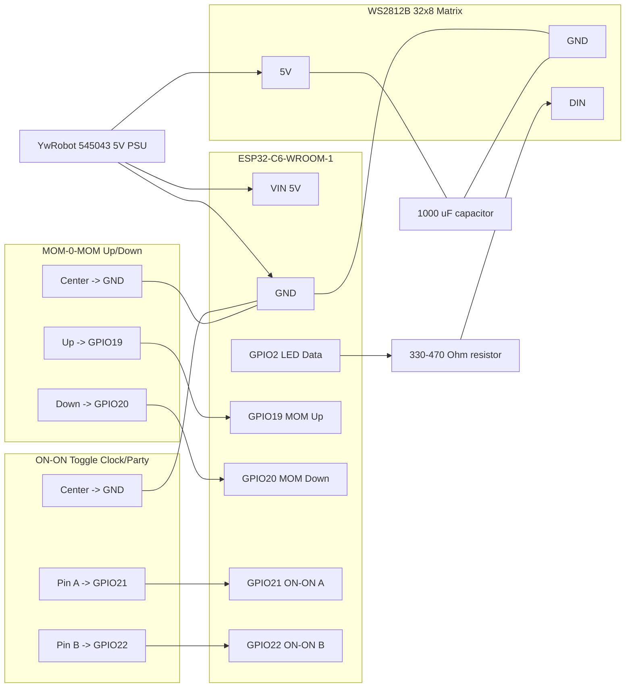

# coolCLOCK

## Essence

* DIY Wi-Fi connected clock using an **ESP32-C6** and a **32×8 WS2812B** LED matrix
* Dual purpose: **Clock** (time via NTP) and **Lamp** (solid/ambient colors)
* Optional **Party Mode** with animated effects and transitions
* **Switches** for:

  * permanent **2-position** toggle → Clock vs Party (mode group)
  * **momentary up/down** (center-return) → select style/effect (up) and color (down)
* **Persistent settings** stored on ESP32 (brightness, colors, modes)

---

## Requirements

### Hardware

* ESP32-C6-WROOM-1 development board
* WS2812B 32×8 LED matrix (256 LEDs)
* Stable 5 V supply (**YwRobot 545043** module, shared between ESP32 and matrix)
* 330-470 Ω series resistor on LED DIN
* ≥1000 µF capacitor across LED 5 V/GND (near matrix)
* **Switches**:

  * 1× **ON-ON** 2-position toggle (3 pins) — metal rod that clicks up/down
  * 1× **MOM-0-MOM** momentary 3-position (3 pins, spring returns to center)
* USB-C / USB cable for flashing & debug
* Optional: 3D-printed case/diffuser

### Software

* Arduino IDE (or PlatformIO)
* ESP32 core (Espressif)
* Libraries:

  * **FastLED**
  * `WiFi.h`, `time.h`, `esp_sntp.h` (ESP32 core)
  * `Preferences.h` (ESP32 NVS storage)

---

## Hardware Wiring

The **YwRobot 545043** provides the 5 V rail for both the ESP32-C6 and the LED matrix.

### Power

* **5V PSU → WS2812B 5V**
* **5V PSU → ESP32 5V (VIN)**
* **GND PSU → WS2812B GND → ESP32 GND** (all grounds common)

Add near the matrix:

* **≥1000 µF** capacitor across 5 V and GND
* **330-470 Ω** series resistor in line with **DIN**

### Data (LEDs)

* **ESP32-C6 GPIO2 → series 330-470 Ω → WS2812B DIN**

### Switches

**Important (C6 pins):** avoid boot/USB pins. Use regular GPIOs like **19, 20, 21, 22**.

#### A) 2-position ON-ON toggle (mode group: Clock/Party)

We'll read it as a **2-bit state** using two GPIOs and the switch's center pin to GND.

* **Common (center) → GND**
* **Outer-A → GPIO21 (INPUT\_PULLUP)**
* **Outer-B → GPIO22 (INPUT\_PULLUP)**

Result (active-LOW):

* Position 1 → GPIO21 = **LOW**, GPIO22 = HIGH  → **Clock group**
* Position 2 → GPIO21 = HIGH, GPIO22 = **LOW**  → **Party group**
* (No floating states; robust and deterministic.)

#### B) MOM-0-MOM (up/down momentary)

Treat as two buttons that share the middle GND:

* **Common (center) → GND**
* **Up contact → GPIO19 (INPUT\_PULLUP)** → "UP button (active-LOW)
* **Down contact → GPIO20 (INPUT\_PULLUP)** → "DOWN" button (active-LOW)

This gives you **UP** to cycle styles/effects and **DOWN** to cycle colors.

## Wiring Diagram

### Notes

* Use **INPUT\_PULLUP** and wire switch contacts to **GND** for clean logic-LOW on press.
* Keep DIN short; place the series resistor close to the first LED.
* Current math: full-white 256 LEDs @ 60 mA each ≈ 15 A. Firmware limits brightness and can use `FastLED.setMaxPowerInVoltsAndMilliamps(...)` to stay modest.

### Safe Pin Choices (ESP32-C6-WROOM-1)

* **Good**: GPIO **2, 3, 6, 7, 10, 11, 18, 19, 20, 21, 22, 23**
* **Avoid**: boot strapping & USB (**4, 5, 8, 9, 12, 13, 15**) and internal flash (24-30).

---

## Current Features

* Wi-Fi + NTP time sync (CET/CEST via TZ rule)
* 5×7 font rendering for text/time
* Demo modes: scan, HELLO, time (test variants)
* Animated effects: sinelon, confetti
* Transition effects: **sweep**, **confetti reveal**
* Non-blocking frame loop

---

## Planned Features

### Clock Mode

* Live time display in multiple styles
* User-selectable color
* Minute-change transitions (when Party group is selected)
* Auto periodic NTP re-sync

### Lamp Mode

* Solid color and ambient gradients
* Adjustable brightness and color
* Optional playful animations in Party mode

### Switch/Buttons Behavior

* **ON-ON toggle (GPIO21/22)** → **Clock** vs **Party** group

  * Read the two lines each frame; choose group accordingly
* **MOM-0-MOM up (GPIO19)** → cycle **styles/effects** within the current group
* **MOM-0-MOM down (GPIO20)** → cycle **colors** (or brightness if you prefer)

> Debounce: use **software debounce** (e.g., 10-20 ms) + **edge detection**.
> Optional long-press/double-tap can be added later; the hardware supports it.

### Settings

* NVS-backed persistence for:

  * Brightness, clock color, lamp color
  * Selected style/effect per group
  * Party enabled state
* Power limiting via FastLED

---

## Roadmap / Milestones

1. **MVP Clock**

   * Stable Wi-Fi + NTP
   * Time display with basic style
   * Brightness limiter

2. **Input Handling**

   * Read ON-ON toggle (2 GPIOs) → select group
   * Read MOM up/down → cycle style/color
   * Software debounce + edge detection

3. **Lamp Mode**

   * Solid & gradient modes
   * Color/brightness control via down/up

4. **Party Mode**

   * Clock: confetti/sweep on transitions
   * Lamp: animations and color flows

5. **Persistence**

   * Save/restore settings from NVS

6. **QoL**

   * OTA updates
   * Wi-Fi fallback AP config
   * Optional Web UI / MQTT

---

## Status

Working:

* Matrix rendering & transitions (sweep, confetti reveal)
* Wi-Fi + NTP on ESP32-C6
* Mode state machine & frame loop

Next:

* Wire the **ON-ON** and **MOM-0-MOM** as above
* Add input polling + debounce + edge detection
* Map behavior: **toggle → group**, **up → style**, **down → color**
* Persist brightness/color/effect
